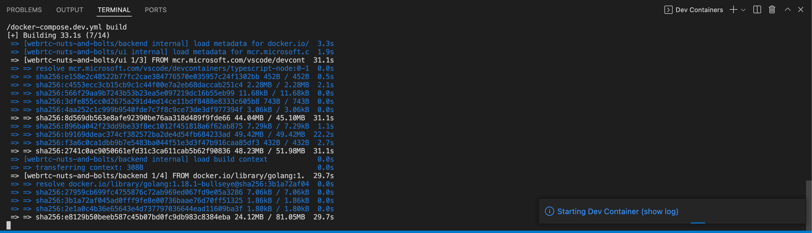
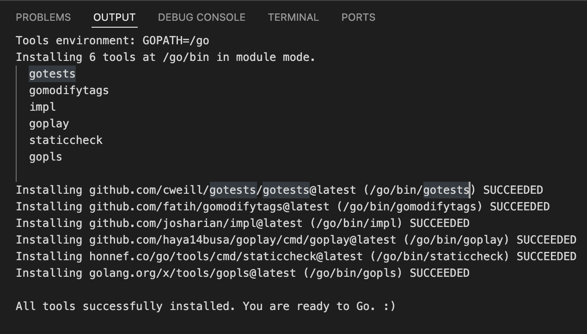
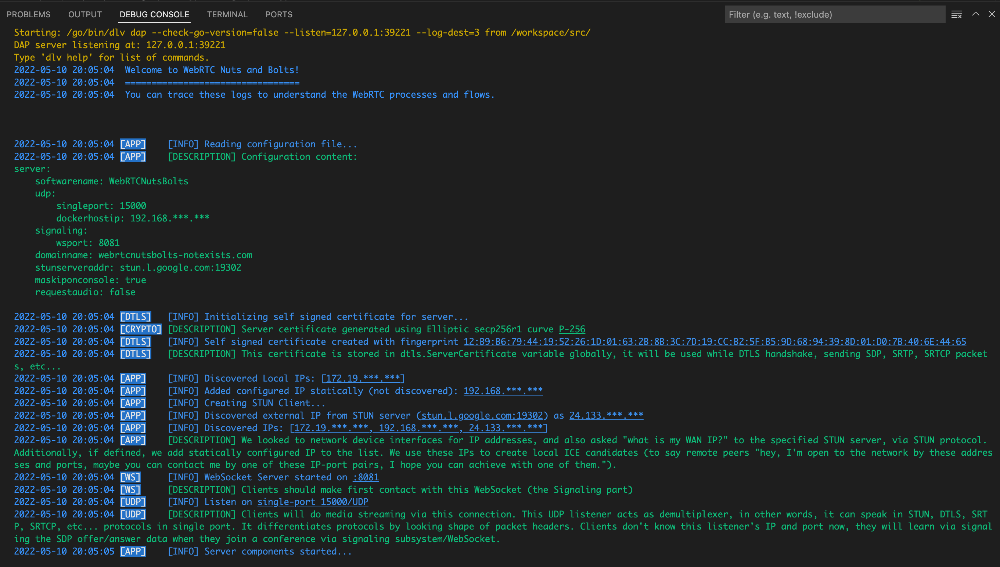

# **1. RUNNING IN DEVELOPMENT MODE**

* Clone this repo.

* Learn your host machine's LAN IP address:

```console
$ ifconfig | grep -Eo 'inet (addr:)?([0-9]*\.){3}[0-9]*' | grep -Eo '([0-9]*\.){3}[0-9]*' | grep -v '127.0.0.1'

192.168.***.***
```

* Open [backend/config.yml](../backend/config.yml) file, write your LAN IP address into server/udp/dockerHostIp section.

* If you don't have VS Code and [Remote Development extension pack](https://marketplace.visualstudio.com/items?itemName=ms-vscode-remote.vscode-remote-extensionpack) installed, install them. [This link](https://code.visualstudio.com/docs/remote/containers) can be helpful.

* Start VS Code, open the cloned folder of "webrtc-nuts-and-bolts".

* Press <kbd>F1</kbd> and select **"Remote Containers: Open Folder in Container..."** then select "backend" folder in "webrtc-nuts-and-bolts".

</img>

</img>

* This command creates (if don't exist) required containers in Docker, then connects inside of webrtcnb-backend container for development and debugging purposes.

* You will see this notification while building image and starting container. If you click on this notification, you will see a log similar to image below.

</img>



* When webrtcnb-backend container has been built and started, VS Code will ask you for some required installations related to Go language, click "Install All" for these prompts.

</img>

* After clicking "Install All", you will see installation logs similar to image below.

</img>

* When you see "You are ready to Go. :)" message in the log, you can press <kbd>F5</kbd> to run and debug our server inside the container. VS Code can ask for installing other dependencies (like "dlv"), click on "Install" again. If VS Code asked for some extra installations, after installation you may need to press <kbd>F5</kbd> again.

* You can switch to **"DEBUG CONSOLE"** tab at bottom, you will be able to see the output of running server application:



* Now your backend server is ready to accept requests from browser!

<br>

---

<div align="right">

[&lt;&nbsp;&nbsp;Previous chapter: INFRASTRUCTURE](./00-INFRASTRUCTURE.md)&nbsp;&nbsp;&nbsp;&nbsp;&nbsp;&nbsp;|&nbsp;&nbsp;&nbsp;&nbsp;&nbsp;&nbsp;[Next chapter: BACKEND INITIALIZATION&nbsp;&nbsp;&gt;](./02-BACKEND-INITIALIZATION.md)

</div>
