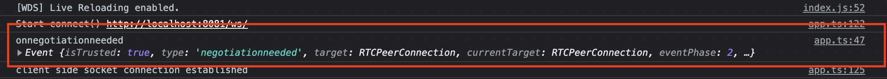
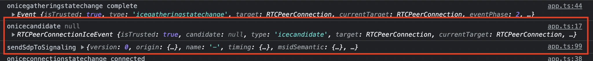

# **3. FIRST CLIENT COMES IN**

In previous chapter, the backend server was initialized and is waiting for clients requesting to join a conference via signaling WebSocket.

Now, we can visit our web application by opening a browser window and writing http://localhost:8080 to the address bar.

**Note:** Tested on Chrome, we think it will run in other modern browsers but it's recommended to use Chrome.

</img>

When the web page was loaded, we run initialization code.

We defined *RTC* and *Signaling* classes in TypeScript in the same file [ui/src/app.ts](../ui/src/app.ts), we create an instance for each one, assign them as property of *window* object to access them globally, our first focus is not "clean code" in this project :blush:
We add onClick event handlers for our two buttons, *BtnCreatePC* and *BtnStopPC* to start and stop our PeerConnection. We also add onBeforeUnload event handler to *window* to close open connections gracefully, so we can inform the server application "hey, we are leaving the conference" on closing the browser tab/window.

<sup>from [ui/src/app.ts](../ui/src/app.ts)</sup>

```ts
const rtc = new RTC();
(<any>window).rtc = rtc;

const signaling = new Signaling();
(<any>window).signaling = signaling;

function initApp() {
    $('#BtnCreatePC').on('click', () => rtc.start());
    $('#BtnStopPC').on('click', () => rtc.stop(true));
    $(window).bind('beforeunload', () => rtc.stop(true));
    
}

initApp();
```

## **3.1. Initialization of RTC object**

In the constructor of the *RTC* class, calls the "createLocalPeerConnection" function which creates a [RTCPeerConnection](https://developer.mozilla.org/en-US/docs/Web/API/RTCPeerConnection), which represents a connection between the local device and a remote peer. This is a native browser API object.

The [constructor of *RTCPeerConnection*](https://developer.mozilla.org/en-US/docs/Web/API/RTCPeerConnection/RTCPeerConnection) takes a configuration parameter (click for [details](https://developer.mozilla.org/en-US/docs/Web/API/RTCPeerConnection/RTCPeerConnection)). We use default values except passing STUN Server URL.

We assign some event handlers for some events, which we will discuss further. We assign handlers to some of them only to print to console, to be informed: "This event was fired".

<sup>from [ui/src/app.ts](../ui/src/app.ts)</sup>

```ts
    ...
    createLocalPeerConnection() {
        const result = new RTCPeerConnection({
            iceServers: [{ urls: 'stun:stun.l.google.com:19302' }]
        });
        result.onicecandidate = (e: RTCPeerConnectionIceEvent) => {
            if (e.candidate === null) {
                console.log('onicecandidate: localSessionDescription:\n', (<any>e.target).localDescription);
            } else {            
                console.log('New ICE candidate:', e.candidate);
            }
        };
        result.addEventListener('track', e => {
            console.log('onTrack', e);
        });
        result.onicecandidateerror = (e: Event) => {
            console.log("onicecandidateerror", "candidate address:", (<any>e).hostCandidate ?? '', "error text:", (<any>e).errorText ?? '', e);
        };
        result.onconnectionstatechange = (e: Event) => {
            console.log('onconnectionstatechange', (<any>e.target).connectionState, '\n', e);
        };
        result.oniceconnectionstatechange = (e: Event) => {
            const peerConnection = <any>e.target;
            this.updateStatus(peerConnection.iceConnectionState);
            console.log('oniceconnectionstatechange', peerConnection.iceConnectionState, '\n', e);
            if (peerConnection.iceConnectionState == 'disconnected') {
                this.stop(true);
            } else if (peerConnection.iceConnectionState === 'connected' || peerConnection.iceConnectionState === 'completed') {
                // Get the stats for the peer connection
                peerConnection.getStats().then((stats: any) => {                
                    stats.forEach((report: any) => {
                        if (report.type === 'candidate-pair' && report.state === 'succeeded') {
                            const localCandidate = stats.get(report.localCandidateId);
                            const remoteCandidate = stats.get(report.remoteCandidateId);
                            console.log('Succeded Local Candidate:', report.localCandidateId, 'address:', localCandidate?.address, 'object:', localCandidate);
                            console.log('Succeded Remote Candidate:', report.remoteCandidateId, 'address:', remoteCandidate?.address, 'object:', remoteCandidate);
                        }
                    });
                });
            }
        };
        result.onicegatheringstatechange = (e: Event) => {
            console.log('onicegatheringstatechange', (<any>e.target).iceGatheringState, '\n', e);
        };
        result.onnegotiationneeded = (e: Event) => {
            console.log('onnegotiationneeded', e);
        };
        result.onsignalingstatechange = (e: Event) => {
            console.log('onsignalingstatechange', (<any>e.target).signalingState, '\n', e);
        };
        return result;
    }
    ...
```

## **3.2. Let the show begin!**

We discussed lots of boring stuff so far (unfortunately there is more)... Now, we click on the "Create PeerConnection" button to start the show!

### **3.2.1 Creating streams, connecting to Signaling Server WebSocket**

The button click will call "rtc.start()" function which:

* Calls "createLocalTracks" method, that says to the browser, "I want a video stream of default webcam, if it can be, should be in height 720p, also I want an audio stream of default microphone". The browser returns a [Promise&lt;MediaStream&gt;](https://developer.mozilla.org/en-US/docs/Web/JavaScript/Reference/Global_Objects/Promise), which we should wait for asking for permissions and (if available and permitted) initialization of camera and microphone devices.

<sup>from [ui/src/app.ts](../ui/src/app.ts)</sup>

```ts
    createLocalTracks(): Promise<MediaStream> {
        return navigator.mediaDevices.getUserMedia({
            video: {
                height: 720
            },
            audio: true
        });
    }
```

* We called this.createLocalTracks, chained further operations by "then" to the returned Promise, and waiting for the browser asks for permissions and create streams for us.

<sup>from [ui/src/app.ts](../ui/src/app.ts)</sup>

```ts
    start() {
        this.updateStatus("starting...");
        this.localConnection = this.createLocalPeerConnection();
        return this.createLocalTracks()
            .then(stream => {
                stream.getTracks().forEach(track => {
                    this.localTracks.push(track);
                    this.localConnection.addTrack(track);
                });
            })
            //.then(() => this.createOffer());
            .then(() => signaling.connect());
    }
```

* The browser asks user for camera and microphone permission for our URL. If you Allow or Deny this request, the browser will remember your decision and won't ask you next time. Now we click on Allow button.

</img>

* After clicking Allow button, the promise gives us a single [MediaStream](https://developer.mozilla.org/en-US/docs/Web/API/MediaStream) object that contains multiple tracks: a video track and an audio track, we can reach them by [stream.getTracks()](https://developer.mozilla.org/en-US/docs/Web/API/MediaStream/getTracks). Currently these tracks are not online yet (not related with any RTC Connection).

* We loop through the tracks of the stream object, store them in our "rtc.localTracks" array for further usage, then add them our [RTCPeerConnection](https://developer.mozilla.org/en-US/docs/Web/API/RTCPeerConnection) "localConnection" by calling [localConnection.addTrack(track)](https://developer.mozilla.org/en-US/docs/Web/API/RTCPeerConnection/addTrack).

* [onnegotiationneeded](https://developer.mozilla.org/en-US/docs/Web/API/RTCPeerConnection/negotiationneeded_event) event of  RTCPeerConnection is called. This says to us that, "I'm ready to send some media stream, but I don't have any negotiation with the remote peer via Signaling. You should send an SDP Offer, or an SDP Offer Answer for an incoming SDP Offer, including this stream".
<br>
In this project's model, first SDP Offer will come from the server via Signaling WebSocket.
<br>
You can find detailed information about the signaling flow here: [Signaling transaction flow](https://developer.mozilla.org/en-US/docs/Web/API/WebRTC_API/Signaling_and_video_calling#signaling_transaction_flow)



* Then other chained function "signaling.connect()" will be called. This function creates a [WebSocket](https://developer.mozilla.org/en-US/docs/Web/API/WebSocket) object with our backend server's WebSocket URL *ws://localhost:8081/ws*. This is native browser API object.

We add related event handlers to our WebSocket client object. We will discuss on "ws.onmessage" futher.

<sup>from [ui/src/app.ts](../ui/src/app.ts)</sup>

```ts
    connect() {
        console.log("Start connect() http://localhost:8081/ws/");
        this.ws = new WebSocket('ws://localhost:8081/ws');

        this.ws.onopen = () => {
            console.log('client side socket connection established');
        };

        this.ws.onclose = () => {
            console.log('client side socket connection disconnected');
        };

        this.ws.onerror = (error) => {
            console.log('Websocket error:', error);
            rtc.stop(true);
            alert("Could not connect to websocket. Ready state: " + (<WebSocket>error.target).readyState);
        };
        ...
    }
```

* Now we are waiting for "Welcome" message from the Signaling Server.

### **3.2.2 The Signaling Server welcomes the client**

When we make the first contact with the backend WebSocket with connecting, "serveWs" function in [backend/src/signaling/httpserver.go](../backend/src/signaling/httpserver.go)
will be triggered. This function creates a WsClient object (defined in [backend/src/signaling/wsclient.go](../backend/src/signaling/wsclient.go)) and it forwards to the wsHub's "register" [channel](https://go.dev/tour/concurrency/2). This channel is listened by run() function of WsHub object, shown below:

<sup>from [backend/src/signaling/httpserver.go](../backend/src/signaling/httpserver.go)</sup>

```go
func (s *HttpServer) serveWs(w http.ResponseWriter, r *http.Request) {
    ...
    client := &WsClient{wsHub: s.WsHub, conn: conn, send: make(chan []byte, 256)}
    client.wsHub.register <- client
    ...
}
```

This method in an infinite loop, when a message forwarded to "register" channel, it registers the new incoming client object itself, and sends a "ClientWelcomeMessage" with message type "Welcome".

<sup>from [backend/src/signaling/wshub.go](../backend/src/signaling/wshub.go)</sup>

```go
func (h *WsHub) run() {
    for {
        select {
        case client := <-h.register:
            h.maxClientId++
            client.id = h.maxClientId
            h.clients[client] = true
            logging.Infof(logging.ProtoWS, "A new client connected: <u>client %d</u> (from <u>%s</u>)", client.id, client.conn.RemoteAddr())
            logging.Descf(logging.ProtoWS, "Sending welcome message via WebSocket. The client is informed with client ID given by the signaling server.")
            writeContainerJSON(client, "Welcome", ClientWelcomeMessage{
                Id:      client.id,
                Message: "Welcome!",
            })
        ...
        }
    }
}
```

### **3.2.3 The client receives the *Welcome* message of Signaling Server, then sends *JoinConference* request**

When any data is received by the WebSocket client, the "ws.onmessage" event will be fired.


The "Welcome message" coming from the server is processed by switch case for "Welcome" "data.type". The code below sends a JSON message that says "I want to join the conference named 'defaultConference'".

<sup>Generated and sent JSON:</sup>

```json
{
    "type": "JoinConference", 
    "data": {
        "conferenceName": "defaultConference"
    }
}
```

<sup>from [ui/src/app.ts](../ui/src/app.ts)</sup>

```ts
    this.ws.onmessage = (message) => {
        let data = null;
        try {
            data = message.data ? JSON.parse(message.data) : null;
        } catch {
            // Do nothing
        }            
        console.log('Received from WS:', message.data);
        if (!data) {
            return;
        }
        switch (data.type) {
            case 'Welcome':
                signaling.ws.send(JSON.stringify({type: "JoinConference", data: {
                    conferenceName: "defaultConference"
                }}));

                break;
        ...
        }
    }
```

### **3.2.4 The client receives the *Welcome* message of Signaling Server, sends *JoinConference* request, then server  sends SDP Offer**

This method in an infinite loop, when a message forwarded to "messageReceived" channel, it [Unmarshalls](https://pkg.go.dev/encoding/json#Unmarshal) it, looks the type attribute of the JSON.
<br>

If it is "JoinConference":

* It calls "processJoinConference" function of WsHub object.
* After, "EnsureConference" function in [backend/src/conference/conferencemanager.go](../backend/src/conference/conferencemanager.go) is called to create a conference object if not exists.
<br>
This function calls "NewConference", which creates a conference object and a new corresponding ServerAgent object for the conference. ServerAgent object stands for the "ICE Agent" concept in WebRTC jargon.
<br>
This agent will store signaled SDP data and UDP sockets related with the conference. Every ICE Agent has a unique Ufrag and Pwd string, which randomly generated while creating the instance. This Ufrag and Pwd data will be sent to the client inside SDP Offer.
<br>
<br>
**Note:** By these Conference and ServerAgent objects per conference, we are able to manage multiple different conference rooms, but in this sample project we use only one conference name "defaultConference", and it doesn't count as a complete conference anyways :blush:
* Then, "GenerateSdpOffer" function in [backend/src/sdp/sdp.go](../backend/src/sdp/sdp.go) is called to create an SDP Offer data, containing media types, ICE candidates' IP and port data, etc...
<br>
The generated SDP Offer data is sent to the client as JSON via Signaling WebSocket.

<sup>from [backend/src/conference/conference.go](../backend/src/conference/conference.go)</sup>

```go
func NewConference(conferenceName string, candidateIPs []string, udpPort int) *Conference {
    result := &Conference{
        ConferenceName: conferenceName,
        IceAgent:       agent.NewServerAgent(candidateIPs, udpPort, conferenceName),
    }
    return result
}
```

<sup>from [backend/src/signaling/wshub.go](../backend/src/signaling/wshub.go)</sup>

```go
func (h *WsHub) run() {
    for {
        select {
        ...
        case receivedMessage := <-h.messageReceived:
            var messageObj map[string]interface{}
            json.Unmarshal(receivedMessage.Message, &messageObj)

            logging.Infof(logging.ProtoWS, "Message received from <u>client %d</u> type <u>%s</u>", receivedMessage.Sender.id, messageObj["type"])
            switch messageObj["type"] {
            case "JoinConference":
                h.processJoinConference(messageObj["data"].(map[string]interface{}), receivedMessage.Sender)
        ...
        }
    }
}
```

During this process, our server console will be similar to this:


### **3.2.5 The client receives the *SdpOffer* message of Signaling Server**

When any data was received by the WebSocket client, the "ws.onmessage" event will be fired.


The "SDP Offer message" coming from the server is processed by switch case for "SdpOffer" "data.type".

* This message came as JSON, we need to convert it to [SDP format](https://en.wikipedia.org/wiki/Session_Description_Protocol) via [sdp-transform](https://www.npmjs.com/package/sdp-transform) library.

<sup>from [ui/src/app.ts](../ui/src/app.ts)</sup>

```ts
    this.ws.onmessage = (message) => {
        ...
        switch (data.type) {
        ...
        case 'SdpOffer':
            const sdpOffer: webrtcnbSdp.SdpMessage = <webrtcnbSdp.SdpMessage>data.data;
            const offerSdp 
            
            = sdpTransform.write({
                origin: {
                    username: 'a_user',
                    sessionId: sdpOffer.sessionId,
                    sessionVersion: 2,
                    netType: 'IN',
                    ipVer: 4,
                    address: '127.0.0.1'
                },
                timing: {
                    start: 0,stop: 0
                },
                setup: 'actpass',
                iceOptions: 'trickle',
                media: sdpOffer.mediaItems.map(mediaItem => {
                    return {
                        mid: mediaItem.mediaId.toString(),
                        type: mediaItem.type,
                        port: 9,
                        rtcpMux: 'rtcp-mux',
                        protocol: 'UDP/TLS/RTP/SAVPF',
                        payloads: mediaItem.payloads,
                        connection: {
                            version: 4,
                            ip: '0.0.0.0'
                        },
                        iceUfrag: mediaItem.ufrag,
                        icePwd: mediaItem.pwd,
                        fingerprint: {
                            type: mediaItem.fingerprintType,
                            hash: mediaItem.fingerprintHash,
                        },
                        candidates: mediaItem.candidates.map(candidate => {
                            return { 
                                foundation: '0',
                                component: 1,
                                transport: candidate.transport,
                                priority: 2113667327,
                                ip: candidate.ip,
                                port: candidate.port,
                                type: candidate.type
                            };
                        }),

                        rtp: [{
                            payload: parseInt(mediaItem.payloads),
                            codec: mediaItem.rtpCodec,
                        }],
                        fmtp: []
                    };
                })
            });
            console.log('offerSdp', offerSdp);
            rtc.acceptOffer(offerSdp);
            break;
        ...
        }
    }
```

* The JSON message converted to the SDP format as:


* We give the SDP Offer string to "acceptOffer" function of our *RTC* object. This function calls [setRemoteDescription](https://developer.mozilla.org/en-US/docs/Web/API/RTCPeerConnection/setRemoteDescription) function of our RTCPeerConnection object. By this, we say our the localConnection (RTCPeerConnection) that "You fired the 'onnegotiationneeded' event and wanted us to SDP Offer/Answer negotiation, we did it and please take it then create an SDP Answer for us".

<sup>from [ui/src/app.ts](../ui/src/app.ts)</sup>

```ts
    acceptOffer(offerSdp: string) {
        return this.localConnection.setRemoteDescription({
            type: 'offer',
            sdp: offerSdp
        })
        .then(() => {
            return this.localConnection.createAnswer()
                .then((answer: RTCSessionDescriptionInit) => {
                    console.log('answer', answer.type, answer.sdp);
                    const parsedSdp: sdpTransform.SessionDescription = sdpTransform.parse(
                        answer.sdp
                    );
                    this.sendSdpToSignaling(parsedSdp);
                    this.localConnection.setLocalDescription(answer);
                });
        });
    }
```

* Now the localConnection object knows which UDP IPs/ports it should try to connect and send it's media tracks.

* Then it should generate an SDP Answer corresponding the server's SDP Offer, we call [createAnswer](https://developer.mozilla.org/en-US/docs/Web/API/RTCPeerConnection/createAnswer).
* We get the created answer SDP, we give it to [setLocalDescription](https://developer.mozilla.org/en-US/docs/Web/API/RTCPeerConnection/setLocalDescription) function of our RTCPeerConnection object. By this, our localConnection exposes it's tracks and fires it's [ontrack event](https://developer.mozilla.org/en-US/docs/Web/API/RTCPeerConnection/track_event).


* During this process, some other events are fired:


* On onicecandidate event fired when our localConnection object's iceGatheringState value comes 'complete', it's time to parse *localConnection.localDescription.sdp* value (generated SDP Answer above), give it to "sendSdpToSignaling" function, converts this SDP Answer to JSON and sends to the client via Signaling.

<sup>from [ui/src/app.ts](../ui/src/app.ts)</sup>

```ts
sendSdpToSignaling(parsedSdp: sdpTransform.SessionDescription) {
    console.log('sendSdpToSignaling', parsedSdp);
    signaling.ws.send(JSON.stringify({type: "SdpOfferAnswer", data: parsedSdp}));
}
```



### **3.2.6 The server receives the *SdpAnswer* message of Signaling Server**

The client generated the SDP Answer corresponding to the SDP Offer the server sent. Then we forward it to ConferenceManager's ChanSdpOffer channel.

<sup>from [backend/src/signaling/wshub.go](../backend/src/signaling/wshub.go)</sup>

```go
func (h *WsHub) run() {
    for {
        select {
        ...
        case receivedMessage := <-h.messageReceived:
            ...
            switch messageObj["type"] {
            ...
            case "SdpOfferAnswer":
                incomingSdpOfferAnswerMessage := sdp.ParseSdpOfferAnswer(messageObj["data"].(map[string]interface{}))
                incomingSdpOfferAnswerMessage.ConferenceName = receivedMessage.Sender.conference.ConferenceName
                h.ConferenceManager.ChanSdpOffer <- incomingSdpOfferAnswerMessage
            ...
            }
        ...
        }
    }
}
```

This method in an infinite loop, when a message forwarded to "ChanSdpOffer" channel, it loops over the incoming SDP Answer's media items, gives items to "EnsureSignalingMediaComponent" function of ServerAgent in [backend/src/agent/serveragent.go](../backend/src/agent/serveragent.go). This function creates SignalingMediaComponent objects per media item, then adds them to "SignalingMediaComponents" property of the ServerAgent. When UDP connection started, the UDP listener compares the ICE information coming from UDP and previously came "SignalingMediaComponents" via Signaling.

<sup>from [backend/src/conference/conferencemanager.go](../backend/src/conference/conferencemanager.go)</sup>

```go
func (m *ConferenceManager) Run(waitGroup *sync.WaitGroup) {
    defer waitGroup.Done()
    for {
        select {
        case sdpOffer := <-m.ChanSdpOffer:
            conference, ok := m.Conferences[sdpOffer.ConferenceName]
            if !ok {
                logging.Warningf(logging.ProtoSDP, "Conference not found: <u>%s</u>, ignoring SdpOffer\n", sdpOffer.ConferenceName)
                continue
            }
            for _, sdpMediaItem := range sdpOffer.MediaItems {
                conference.IceAgent.EnsureSignalingMediaComponent(sdpMediaItem.Ufrag, sdpMediaItem.Pwd, sdpMediaItem.FingerprintHash)
            }
            logging.Descf(logging.ProtoSDP, "We processed incoming SDP, notified the conference's ICE Agent object (SignalingMediaComponents) about client (media) components' ufrag, pwd and fingerprint hash in the SDP. The server knows some metadata about the UDP packets will come in future. Now we are waiting for a STUN Binding Request packet via UDP, with server Ufrag <u>%s</u> from the client!", sdpOffer.MediaItems[0].Ufrag)
        }
    }
}
```

The server logs when received the SDP Answer via Signaling.

**Note:** At the top lines of screenshoot below, we can see that, client sent a STUN Binding Request via UDP port, before sending SDP Answer via Signaling. Despite it is a valid STUN Binding Request message, we ignore this packet, because we don't know the media track SDP information yet.

Then client sent SDP Answer via Signaling, now we are ready to receive STUN Binding Request message via UDP, for this media stream.


Now, we will be waiting for a STUN Binding Request from the client over UDP port.

<br>

---

<div align="right">

[&lt;&nbsp;&nbsp;Previous chapter: BACKEND INITIALIZATION](./02-BACKEND-INITIALIZATION.md)&nbsp;&nbsp;&nbsp;&nbsp;&nbsp;&nbsp;|&nbsp;&nbsp;&nbsp;&nbsp;&nbsp;&nbsp;[Next chapter: STUN BINDING REQUEST FROM CLIENT&nbsp;&nbsp;&gt;](./04-STUN-BINDING-REQUEST-FROM-CLIENT.md)

</div>
