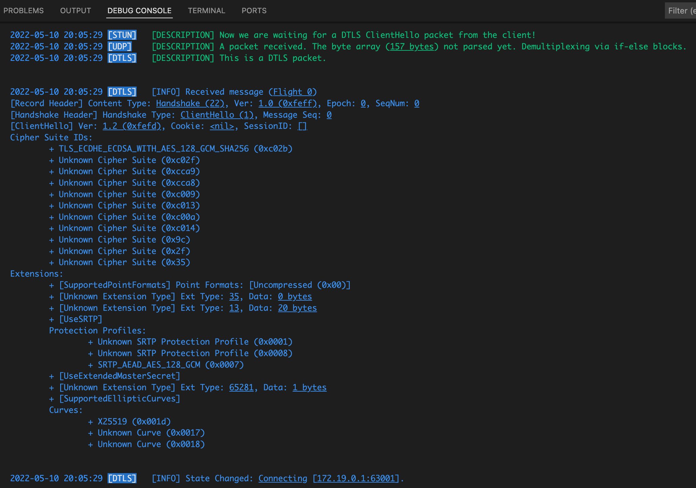
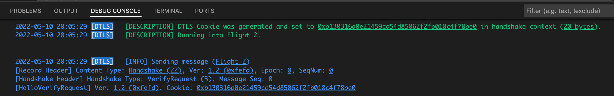
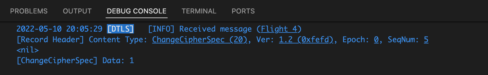
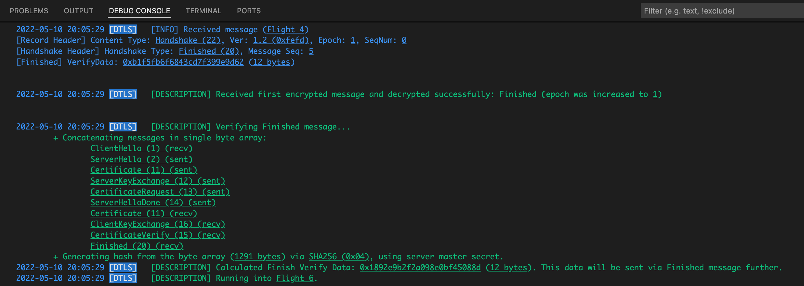
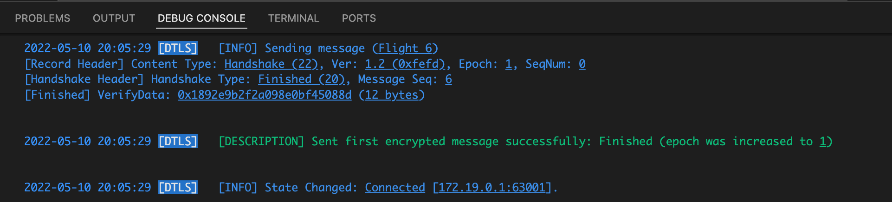

# **5. DTLS HANDSHAKE**

In previous chapter, we received first "expected" UDP packet (STUN Binding Request), then sent a STUN Binding Response as an answer. This means that, the client can start [DTLS Handshake](https://datatracker.ietf.org/doc/html/rfc4347#section-4.2) process.

[DTLS (Datagram Transport Layer Security)](https://en.wikipedia.org/wiki/Datagram_Transport_Layer_Security) for secure handshake, authenticating each other, and crypto key exchange process. DTLS is similar to [TLS (Transport Layer Security)](https://tr.wikipedia.org/wiki/Transport_Layer_Security), DTLS runs over UDP instead of TCP. This project supports only DTLS v1.2.

DTLS Handshake consists of some "flights" between client and server, schematized [here](https://tools.ietf.org/html/rfc4347#section-4.2.4) as:

```
    ------                                          ------

    ClientHello             -------->                           Flight 1

                            <-------    HelloVerifyRequest      Flight 2

   ClientHello              -------->                           Flight 3

                                               ServerHello    \
                                              Certificate*     \
                                        ServerKeyExchange*      Flight 4
                                       CertificateRequest*     /
                            <--------      ServerHelloDone    /

    Certificate*                                              \
    ClientKeyExchange                                          \
    CertificateVerify*                                          Flight 5
    [ChangeCipherSpec]                                         /
    Finished                -------->                         /

                                        [ChangeCipherSpec]    \ Flight 6
                            <--------             Finished    /

```

Sources:
* [Breaking Down the TLS Handshake](https://www.youtube.com/watch?v=cuR05y_2Gxc&list=PLyqga7AXMtPMXgn1NwDqnSlgU05cnl4PA) (Before continuing, it's highly recommended to watch this Youtube playlist to understand TLS Handshake process, ciphers, curves, hashing, algorithms, etc... In videos, they tell about TLS v1.2 and v1.3, but we don't use v1.3).

<br>

## **5.1. Client sends first ClientHello message (Flight 0)**
<br>

When a new packet comes in, the "AddBuffer" function in [backend/src/agent/udpclientsocket.go](../backend/src/agent/udpclientsocket.go) looks for which protocol standard this packet to rely on.

In this context, we can check out dtls.IsDtlsPacket function. This function checks:
  * Data length (arrayLen) is greater than zero
  <br>and
  * First byte of data (ordinally) is between 20 and 63. This byte represents the DTLS Record Header's ContentType value.

If this buffer part complies with these conditions, we can say "this packet is a DTLS protocol packet", then we can process it with DTLS protocol's methods.

<sup>from [backend/src/dtls/dtlsmessage.go](../backend/src/dtls/dtlsmessage.go)</sup>
```go
func IsDtlsPacket(buf []byte, offset int, arrayLen int) bool {
    return arrayLen > 0 && buf[offset] >= 20 && buf[offset] <= 63
}
```

Here is the console output when the server received an "expected" DTLS ClientHello message.

</img>

We determined that this packet is DTLS packet. A DTLS packet consists of a Record Header and Content. If ContentType is "Handshake" (22), packet consists of Record Header, Handshake Header and Handshake Content.

The ClientHello packet we received is a "Handshake" message, so we should discuss the structure of a Handshake packet.

<br>

## **5.1.1. DTLS Record Header**
<br>

<sup>from [backend/src/dtls/recordheader.go](../backend/src/dtls/recordheader.go)</sup>
```go
type RecordHeader struct {
    ContentType    ContentType
    Version        DtlsVersion
    Epoch          uint16
    SequenceNumber [SequenceNumberSize]byte //SequenceNumberSize: 6 (48 bit)
    Length         uint16
}
```

You can find:
* Detailed information about attributes of this record in [WebRTC for the Curious: Securing - DTLS](https://webrtcforthecurious.com/docs/04-securing/#dtls)
* ContentType constants in [backend/src/stun/messagetype.go](../backend/src/dtls/recordheader.go)
* DtlsVersion constants in [backend/src/stun/messagetype.go](../backend/src/dtls/recordheader.go)

If Epoch is zero, the contents of the packet is in clear text, not encrypted. If not, contents are encrypted with the cipher suite which negotiated before while handshake proccess.

Source: [Generic header structure of the DTLS record layer](https://github.com/eclipse/tinydtls/blob/706888256c3e03d9fcf1ec37bb1dd6499213be3c/dtls.h#L320)

<br>

## **5.1.2. DTLS Record Header**
<br>

<sup>from [backend/src/dtls/handshakeheader.go](../backend/src/dtls/handshakeheader.go)</sup>
```go
type HandshakeHeader struct {
    HandshakeType   HandshakeType
    Length          uint24
    MessageSequence uint16
    FragmentOffset  uint24
    FragmentLength  uint24
}
```

* You can find HandshakeType constants in [backend/src/dtls/handshakeheader.go](../backend/src/dtls/handshakeheader.go)
* "uint24" is defined in [backend/src/dtls/dtlsmessage.go](../backend/src/dtls/dtlsmessage.go), to represent 24 byte unsigned integer values in handshake data structure.

<sup>from [backend/src/dtls/dtlsmessage.go](../backend/src/dtls/dtlsmessage.go)</sup>
```go
type uint24 [3]byte
```

* MessageSequence: Message Sequence of Handshake Header (different from RecordHeader's SequenceNumber) should be kept in track incoming and outgoing handshake packets as "ClientSequenceNumber" and "ServerHandshakeSequenceNumber" in [backend/src/dtls/handshakecontext.go](../backend/src/dtls/handshakecontext.go)
* **DTLS Fragmentation:** Handshake messages can be larger (larger than 1KB), e.g. can transmit a X.509 certificate data. In networking, there is a concept called [MTU (Maximum Transmission Unit)](https://en.wikipedia.org/wiki/Maximum_transmission_unit) to optimize some tradeoffs explained [here](https://en.wikipedia.org/wiki/Maximum_transmission_unit). These principles require to split a larger packet into smaller pieces. These pieces can be transmitted in an unordered way. So we can track the order of the packets and completeness of them using FragmentOffset and FragmentLength information.
<br>
DTLS fragmentation is not supported in this project, so we ignore these fragmentation information.

Source: [Header structure for the DTLS handshake protocol](https://github.com/eclipse/tinydtls/blob/706888256c3e03d9fcf1ec37bb1dd6499213be3c/dtls.h#L344)


<br>

## **5.1.3. ClientHello Message Content (Flight 0)**
<br>

The ClientHello message is the first message of the first flight. The RFC counts flights starting from 1, we count them starting from 0, because we assume the Flight 0 is "waiting for ClientHello" state, Flight 1 is after receiving the first ClientHello. So, you can track the flight numbers this way. 

<sup>from [backend/src/dtls/clienthello.go](../backend/src/dtls/clienthello.go)</sup>
```go
type ClientHello struct {
    Version              DtlsVersion
    Random               Random
    Cookie               []byte
    SessionID            []byte
    CipherSuiteIDs       []CipherSuiteID
    CompressionMethodIDs []byte
    Extensions           map[ExtensionType]Extension
}
```

This message is bootstrapper of a new DTLS Handshake process. Client says to us, "I want to make a DTLS handshake with you, these are my security data to share".

* Version: Same logic and structure with the Version of RecordHeader. Value can differ, for e.g. RecordHeader's version can be 1.0 but ClientHello's version can be 1.2.
* Random: Each part (the client and the server) generates random values for themselves, we call them as "Client Random" and "Server Random". In DTLS v1.2, random byte array consists of 32 bytes. The first 4 bytes are for current system time, remaining 28 bytes are randomly generated. 

<sup>from [backend/src/dtls/random.go](../backend/src/dtls/random.go)</sup>
```go
type Random struct {
    GMTUnixTime time.Time
    RandomBytes [RandomBytesLength]byte
}
```

Source: [Pion WebRTC: DTLS Random](https://github.com/pion/dtls/blob/b3e235f54b60ccc31aa10193807b5e8e394f17ff/pkg/protocol/handshake/random.go)

* Cookie: Randomly generated 20 bytes. But in first flight, first ClientHello's Cookie is empty. The second one will come not empty, we will discuss further.
* SessionID: We didn't use this data, pass empty array, at least in this project.
* CipherSuiteIDs: Each party has implemented and supported a set of [Cipher Suite](https://en.wikipedia.org/wiki/Cipher_suite)s, in DTLS and TLS each of them coded with uint16 constant value. With this information, the client informs us "I support these cipher suites, choose one of them which you support too, then we can continue using it."
<br>
A "Cipher Suite" is a set of algorithms, usually consists of a key exchange algorithm, a hash algorithm and signature/authentication algorithm. You can find cipher suites and values [here](https://www.rfc-editor.org/rfc/rfc8422.html#section-6), and our only one supported cipher suite constant at [backend/src/dtls/ciphersuites.go](../backend/src/dtls/ciphersuites.go).
* CompressionMethodIDs: We only support Uncompressed mode with value zero.
* Extensions: Client can send a list of extension data with the ClientHello message. Some of them which we support:
    * UseExtendedMasterSecret: In encryption, we use a "master secret". Each party generates their own "master secret" and don't share it with others. There are some ways to generate it, a standard way and an extended way. We will discuss about this, but if ClientHello contains a UseExtendedMasterSecret extension, it means "the client uses extended master secret generation method, you should use it too".
    * SupportedEllipticCurves (Supported Groups): Elliptic curve types that the client supports. We support only X25519. You can find further NamedCurve types [here](https://www.rfc-editor.org/rfc/rfc8422.html#section-5.1.1), and our only one supported Curve constant (X25519) at [backend/src/dtls/ciphersuites.go](../backend/src/dtls/ciphersuites.go).
    * SupportedPointFormats: We only will use "Uncompressed" value
    * UseSRTP: In an unencrypted way, the media streaming is made with [RTP (Real-time Transport Protocol)](https://en.wikipedia.org/wiki/Real-time_Transport_Protocol) without any encryption. But WebRTC mandates using an encryption mechanism in transportation. If RTP packets are encrypted and authenticated, we call it [SRTP (Secure Real-time Transport Protocol)](https://en.wikipedia.org/wiki/Secure_Real-time_Transport_Protocol).
    <br>
    This extension contains IDs of SRTP Protection Profiles which the client supports. We support only SRTPProtectionProfile_AEAD_AES_128_GCM. You can find further SRTP Protection profile types [here](https://www.iana.org/assignments/srtp-protection/srtp-protection.xhtml), and our only one supported profile constant (AEAD_AES_128_GCM) at [backend/src/dtls/ciphersuites.go](../backend/src/dtls/ciphersuites.go).

    <br><br>
    After receiving the first ClientHello (which doesn't contain a Cookie value), we:
    * Set our DTLS Handshake Context's (HandshakeContext defined in [backend/src/dtls/handshakecontext.go](../backend/src/dtls/handshakecontext.go)) state as "Connecting"
    * Set the context's ProtocolVersion as incoming ClientHello's Version. We should check it, but in this project we assume two parties speak with DTLS v1.2.
    * Generate a 20 bytes DTLS Cookie by calling "generateDtlsCookie" function, and set the context's Cookie property.
    * Set the context's Flight to "Flight 2"

<br>

## **5.2. Server sends HelloVerifyRequest message (Flight 2)**
<br>

We generate a HelloVerifyRequest message by calling "createDtlsHelloVerifyRequest" function in [backend/src/dtls/handshakemanager.go](../backend/src/dtls/handshakemanager.go). We share the Cookie data which we generated previously (in context.Cookie) with the client.

<sup>from [backend/src/dtls/helloverifyrequest.go](../backend/src/dtls/helloverifyrequest.go)</sup>
```go
type HelloVerifyRequest struct {
    Version DtlsVersion
    Cookie  []byte
}
```

Now we are waiting for another (nearly the same) ClientHello message, but with a Cookie that has the same value as our HelloVerifyRequest.

</img>


<br>

## **5.3. Client sends second ClientHello message (Flight 2)**
<br>

</img>

We received second ClientHello from the client, with nearl same content but with a Cookie.

We:
* Know we are in Flight 2, we check if the incoming ClientHello's Cookie value and we sent via HelloVerifyRequest (stored in our context object). If it is empty, we should return to Flight 0 state and wait for a new ClientHello message. If not empty, we should compare two values.
* Find a cipher suite ID which mutually supported by each peer, via calling "negotiateOnCipherSuiteIDs" function in [backend/src/dtls/handshakemanager.go](../backend/src/dtls/handshakemanager.go), then set it to context.CipherSuite. In our example, negotiated on TLS_ECDHE_ECDSA_WITH_AES_128_GCM_SHA256 (0xc02b) cipher suite.
* Loop through ClientHello message's extensions. We process the known and supported ones, and ignore unknown ones. Tracking the order at console output below:
    * UseSRTP extension found: Find an SRTP Protection Profile ID which mutually supported by each peer, via calling "negotiateOnSRTPProtectionProfiles" function in [backend/src/dtls/handshakemanager.go](../backend/src/dtls/handshakemanager.go), then set it to context.SRTPProtectionProfile. In our example, negotiated on SRTP_AEAD_AES_128_GCM (0x0007) protection profile.
    * UseExtendedMasterSecret extension found: We set context.UseExtendedMasterSecret = true, we will generate the master secret with extended way further.
    * SupportedEllipticCurves extension found: Find a Named Curve ID which mutually supported by each peer, via calling "negotiateOnCurves" function in [backend/src/dtls/handshakemanager.go](../backend/src/dtls/handshakemanager.go), then set it to context.Curve. In our example, negotiated on X25519 (0x001d) named curve.


<br>

### **5.3.1. Generating cryptographic keys**
<br>

Now, server chose one from each cryptographic methods, algorithms etc... which client offered as alternatives. The server knows which methods they will use while encrypting, the client will learn further. The server should generate some secrets and keys, for it's side.

We:
* Set incoming ClientHello.Random to context.ClientRandom
* Generate a Server Random via calling "Generate" function in [backend/src/dtls/random.go](../backend/src/dtls/random.go) and set it to context.ServerRandom.
* Generate a server private and server public key, by using [X25519 curve](https://pkg.go.dev/golang.org/x/crypto@v0.0.0-20220411220226-7b82a4e95df4/curve25519), via calling "GenerateCurveKeypair" function in [backend/src/dtls/crypto.go](../backend/src/dtls/crypto.go). These private and public keys are different from and not related with previously generated Server Certificate keys.
    * Randomly generate 32 bytes array of private key
    * Calculate the public key (32 bytes) by using [curve25519.ScalarBaseMult](https://pkg.go.dev/golang.org/x/crypto@v0.0.0-20220411220226-7b82a4e95df4/curve25519#ScalarBaseMult)
* Store these generated private key as context.ServerPrivateKey, public key as context.ServerPublicKey.
* Generate the ServerKeySignature by calling "GenerateKeySignature" function in [backend/src/dtls/crypto.go](../backend/src/dtls/crypto.go).
    * Generate a signed_params message (signed_params) which consists concatenating of (total 100 bytes) (checkout [signed_params enum](https://datatracker.ietf.org/doc/html/rfc5246#section-7.4.3)), via "generateValueKeyMessage" function in [backend/src/dtls/crypto.go](../backend/src/dtls/crypto.go):
        * Client random (32 bytes)
        * Server random (32 bytes)
        * ECDH Params (4 bytes)
            * \[0\]: NamedCurve (0x03)
            * \[1:2\]: X25519 (0x001d)
            * \[3\]: 32 (public key length)
        * Public key (32 bytes)

    * Calculate hash of the "signed_params message" via "hashAlgorithm.Execute" function in [backend/src/dtls/ciphersuites.go](../backend/src/dtls/ciphersuites.go) by [sha256.Sum256](https://pkg.go.dev/crypto/sha256#Sum256), hashing result is 32 bytes
    * Sign the hash value via "privateKeyObj.Sign" by [ecdsa privateKey.Sign](https://pkg.go.dev/crypto/ecdsa#PrivateKey.Sign). Result is 72 bytes.
    <br>
    ***Attention Note:** We hash a byte array contains the context.ServerPublicKey, then sign the result via ServerCertificate.PrivateKey. Public key was generated via "GenerateCurveKeypair", ServerCertificate.PrivateKey was the ServerCertificate's PrivateKey.
    * We set this calculated signature to context.ServerKeySignature

<sup>from [backend/src/dtls/handshakemanager.go](../backend/src/dtls/handshakemanager.go)</sup>
```go
context.ServerKeySignature, err = GenerateKeySignature(
                clientRandomBytes,
                serverRandomBytes,
                context.ServerPublicKey,
                context.Curve, //x25519
                ServerCertificate.PrivateKey,
                context.CipherSuite.HashAlgorithm)
```

<sup>from [backend/src/dtls/crypto.go](../backend/src/dtls/crypto.go)</sup>
```go
func GenerateKeySignature(clientRandom []byte, serverRandom []byte, publicKey []byte, curve Curve, privateKey crypto.PrivateKey, hashAlgorithm HashAlgorithm) ([]byte, error) {
    msg := generateValueKeyMessage(clientRandom, serverRandom, publicKey, curve)
    switch privateKeyObj := privateKey.(type) {
    case *ecdsa.PrivateKey:
        hashed := hashAlgorithm.Execute(msg) //SHA256 sum
        logging.Descf(logging.ProtoCRYPTO, "signed_params values hashed: <u>0x%x</u> (<u>%d</u> bytes)", hashed, len(hashed))
        signed, err := privateKeyObj.Sign(rand.Reader, hashed, hashAlgorithm.CryptoHashType()) //crypto.SHA256
        logging.Descf(logging.ProtoCRYPTO, "signed_params values signed (result will be called as ServerKeySignature): <u>0x%x</u> (<u>%d</u> bytes)", signed, len(signed))
        return signed, err
    }
    return nil, errors.New("not supported private key type")
}
```

* Set the context's Flight to "Flight 4"

Now we are ready to send a group of messages: A ServerHello, a Certificate, a ServerKeyExchange, a CertificateRequest, and a ServerHelloDone message. These messages can be sent in same packet (by fragmenting) or one by one. We prefer to send them individually, one by one.

Sources:
* [Pion WebRTC: DTLS, Generating Elliptic Keypair](https://github.com/pion/dtls/blob/bee42643f57a7f9c85ee3aa6a45a4fa9811ed122/pkg/crypto/elliptic/elliptic.go#L70)

<br>

## **5.4. Server sends ServerHello message (Flight 4)**
<br>

We generate a ServerHello message by calling "createDtlsServerHello" function in [backend/src/dtls/handshakemanager.go](../backend/src/dtls/handshakemanager.go).

<sup>from [backend/src/dtls/serverhello.go](../backend/src/dtls/serverhello.go)</sup>
```go
type ServerHello struct {
    Version   DtlsVersion
    Random    Random
    SessionID []byte

    CipherSuiteID       CipherSuiteID
    CompressionMethodID byte
    Extensions          map[ExtensionType]Extension
}
```

* Set Version to context.ProtocolVersion
* Set Random to context.ServerRandom
* Set CipherSuiteID to context.CipherSuite.ID
* Add UseExtendedMasterSecret extension if context.UseExtendedMasterSecret is true (ClientHello contains UseExtendedMasterSecret extension)
* Add RenegotiationInfo extension (despite we don't support renegotiation)
* Add UseSRTP extension with context.SRTPProtectionProfile value (SRTPProtectionProfile_AEAD_AES_128_GCM - 0x0007)
* Add SupportedPointFormats extension with PointFormatUncompressed (default, zero) value

</img>

ServerHello message was sent.

<br>

## **5.5. Server sends Certificate message (Flight 4)**
<br>

We generate a Certificate message by calling "createDtlsCertificate" function in [backend/src/dtls/handshakemanager.go](../backend/src/dtls/handshakemanager.go).

<sup>from [backend/src/dtls/certificate.go](../backend/src/dtls/certificate.go)</sup>
```go
type Certificate struct {
    Certificates [][]byte
}
```

* Set Certificates to ServerCertificate.Certificate

We shared our X.509 Server Certificate data with the client.

</img>

Certificate message was sent.

<br>

## **5.6. Server sends ServerKeyExchange message (Flight 4)**
<br>

We generate a ServerKeyExchange message by calling "createDtlsServerKeyExchange" function in [backend/src/dtls/handshakemanager.go](../backend/src/dtls/handshakemanager.go).

<sup>from [backend/src/dtls/serverkeyexchange.go](../backend/src/dtls/serverkeyexchange.go)</sup>
```go
type ServerKeyExchange struct {
    EllipticCurveType CurveType
    NamedCurve        Curve
    PublicKey         []byte
    AlgoPair          AlgoPair
    Signature         []byte
}
```

* Set EllipticCurveType to context.CurveType (CurveTypeNamedCurve 0x03)
* Set NamedCurve to context.Curve (CurveX25519 0x001d)
* Set PublicKey to context.ServerPublicKey
* Set AlgoPair to AlgoPair{
    <br>
    HashAlgorithm:      context.CipherSuite.HashAlgorithm *(HashAlgorithmSHA256 - 4)*
    <br>
    SignatureAlgorithm: context.CipherSuite.SignatureAlgorithm *(SignatureAlgorithmECDSA - 3)*
    <br>
    }
* Set Signature to context.ServerKeySignature


ServerKeyExchange message was sent.

<br>

## **5.7. Server sends CertificateRequest message (Flight 4)**
<br>

We generate a CertificateRequest message by calling "createDtlsCertificateRequest" function in [backend/src/dtls/handshakemanager.go](../backend/src/dtls/handshakemanager.go).

<sup>from [backend/src/dtls/certificaterequest.go](../backend/src/dtls/certificaterequest.go)</sup>
```go
type CertificateRequest struct {
    CertificateTypes []CertificateType
    AlgoPairs        []AlgoPair
}
```

* Set CertificateTypes to [CertificateTypeECDSASign (0x40)]
* Set AlgoPairs to [AlgoPair{
    <br>
    HashAlgorithm:      context.CipherSuite.HashAlgorithm *(HashAlgorithmSHA256 - 4)*
    <br>
    SignatureAlgorithm: context.CipherSuite.SignatureAlgorithm *(SignatureAlgorithmECDSA - 3)*
    <br>
    }]

We requested for a client certificate which ECDSASign type, generated using hash algorithm SHA256 and signature algorithm ECDSA.

</img>

CertificateRequest message was sent.

<br>

## **5.8. Server sends ServerHelloDone message (Flight 4)**
<br>

We generate a ServerHelloDone message by calling "createDtlsServerHelloDone" function in [backend/src/dtls/handshakemanager.go](../backend/src/dtls/handshakemanager.go).

<sup>from [backend/src/dtls/serverhellodone.go](../backend/src/dtls/serverhellodone.go)</sup>
```go
type ServerHelloDone struct {
}
```

The message doesn't carry any data.

</img>

ServerHelloDone message was sent.

Now we are waiting for a group of messages: A Certificate, a ClientKeyExchange, a CertificateVerify, a ChangeCipherSpec, a Finished message. For e.g., if our client is Chrome, it will send these messages in one packet.


<br>

## **5.9. Client sends Certificate message (Flight 4)**
<br>


<sup>from [backend/src/dtls/certificate.go](../backend/src/dtls/certificate.go)</sup>
```go
type Certificate struct {
    Certificates [][]byte
}
```

The client shared their X.509 Server Certificate data with the server. 

* Set context.ClientCertificates to message.Certificates
* Call "GetCertificateFingerprintFromBytes" function in [backend/src/dtls/crypto.go](../backend/src/dtls/crypto.go) to generate the fingerprint hash from the certificate byte array
* Compare the calculated fingerprint hash with context.ExpectedFingerprintHash which came with SDP data previously. So we can ensure that "the sender of SDP via Signaling" and "the sender of these handshake messages" are the same person/machine, not another man in the middle.


<br>

## **5.9. Client sends ClientKeyExchange message (Flight 4)**
<br>


<sup>from [backend/src/dtls/clientkeyexchange.go](../backend/src/dtls/clientkeyexchange.go)</sup>
```go
type ClientKeyExchange struct {
    PublicKey []byte
}
```

* Set context.ClientKeyExchangePublic to message.PublicKey
* If context.IsCipherSuiteInitialized is false (our cipher suite is not initialized yet), we are ready to initialize our cipher suite, call "initCipherSuite" function in from [backend/src/dtls/handshakemanager.go](../backend/src/dtls/handshakemanager.go)


<br>

### **5.9.1. Initialization of cipher suite**
<br>

We need to generate a master secret. Then using this master secret, client random, and server random, we will initialize our keys. We will use these keys while encrypting/decrypting the SRTP packets further.


<br>

#### **5.9.1.1. Generate a Pre-Master Secret**
<br>

We call "GeneratePreMasterSecret" function in [backend/src/dtls/crypto.go](../backend/src/dtls/crypto.go)

<sup>from [backend/src/dtls/handshakemanager.go](../backend/src/dtls/handshakemanager.go)</sup>
```go
    preMasterSecret, err := GeneratePreMasterSecret(context.ClientKeyExchangePublic, context.ServerPrivateKey, context.Curve)
```

* Generate a byte array using the public key which came by ClientKeyExchange message, and our ServerPrivateKey via [curve25519.X25519](https://pkg.go.dev/golang.org/x/crypto@v0.0.0-20220411220226-7b82a4e95df4/curve25519#X25519). We call is as "pre-master key"
<br>
***Attention Note:** Public key was the ClientKeyExchange message's Public Key, the ServerPrivateKey was generated via "GenerateCurveKeypair".

Sources:
* [Differences between the terms "pre-master secret", "master secret", "private key", and "shared secret"? (Stackoverflow)](https://crypto.stackexchange.com/questions/27131/differences-between-the-terms-pre-master-secret-master-secret-private-key)


<br>

#### **5.9.1.2. Generate a Master Secret**
<br>

We look to our context.UseExtendedMasterSecret boolean value. Remember that, if ClientHello message has UseExtendedMasterSecret extension, we should generate our master secret in extended way.

**If context.UseExtendedMasterSecret is true:**

* Concatenate previous (sent and received) handshake messages as one byte array in a row via "concatHandshakeMessages" function in [backend/src/dtls/handshakemanager.go](../backend/src/dtls/handshakemanager.go). <br>
Don't forget that, we cached latest received and sent messages by handshake message types in *context.HandshakeMessagesReceived* and *context.HandshakeMessagesSent* maps.
<br>
Order should be like:
    * ClientHello (recv)
    * ServerHello (sent)
    * Certificate (sent)
    * ServerKeyExchange (sent)
    * CertificateRequest (sent)
    * ServerHelloDone (sent)
    * Certificate (recv)
    * ClientKeyExchange (recv)

* In the screenshoot below (and also the screenshoot in chapter 5.9), we can see the concatenation result took *1179 bytes*.
* Calculate hash of the "handshakeMessages" byte array via "hashAlgorithm.Execute" function in [backend/src/dtls/ciphersuites.go](../backend/src/dtls/ciphersuites.go) by [sha256.Sum256](https://pkg.go.dev/crypto/sha256#Sum256), hashing result is 32 bytes. We call this value as "handshakeHash".
* Call "GenerateExtendedMasterSecret" function in [backend/src/dtls/crypto.go](../backend/src/dtls/crypto.go) with our *preMasterSecret*, *handshakeHash*, *context.CipherSuite.HashAlgorithm*.

<sup>from [backend/src/dtls/crypto.go](../backend/src/dtls/crypto.go)</sup>
```go
func GenerateExtendedMasterSecret(preMasterSecret []byte, handshakeHash []byte, hashAlgorithm HashAlgorithm) ([]byte, error) {
    seed := append([]byte("extended master secret"), handshakeHash...)
    result, err := PHash(preMasterSecret, seed, 48, hashAlgorithm)
    if err != nil {
        return nil, err
    }
    logging.Descf(logging.ProtoCRYPTO, "Generated Extended MasterSecret using Pre-Master Secret, Handshake Hash via <u>%s</u>: <u>0x%x</u> (<u>%d bytes</u>)", hashAlgorithm, result, len(result))
    return result, nil
}
```

* In the "GenerateExtendedMasterSecret" function:
    * Create the "seed" by concatenating "extended master secret" string value with our handshakeHash byte array. You can find details [here](https://datatracker.ietf.org/doc/html/rfc7627#section-4).
    * Call the "PHash" function [backend/src/dtls/crypto.go](../backend/src/dtls/crypto.go) to generate 48 bytes Extended Master Secret, which is calculated using our **preMasterSecret**, **seed** by [sha256.Sum256](https://pkg.go.dev/crypto/sha256#Sum256).
    <br>
    "PHash" function is a [Pseudorandom Function (PRF)](https://en.wikipedia.org/wiki/Pseudorandom_function_family), you can find further information [here](https://en.wikipedia.org/wiki/Pseudorandom_function_family) and [here](https://github.com/pion/dtls/blob/a6397ff7282bc56dc37a68ea9211702edb4de1de/pkg/crypto/prf/prf.go#L155). This function returns a byte array with length the *requestedLength* parameter you gave. In this case, we gave *48* as *requestedLength*, it returned an array of 48 bytes.

* Set the result of "GenerateExtendedMasterSecret" function to context.ServerMasterSecret.


**If context.UseExtendedMasterSecret is false:**

**Note:** In current context, our code won't come this state, because (I think) Chrome always sends the UseExtendedMasterSecret extension with ClientHello message. But we can discuss on generating non-extended master secret:

* Call "GenerateMasterSecret" function in [backend/src/dtls/crypto.go](../backend/src/dtls/crypto.go) with our *preMasterSecret*, *clientRandom*, *serverRandom*, *context.CipherSuite.HashAlgorithm*.
* In the "GenerateMasterSecret" function:
    * Create the "seed" by concatenating "master secret" string value, clientRandom and serverRandom.
    <br>
    **Important note:** The order of clientRandom and serverRandom is important, can vary by "being a client" or "being a server" as application.
    * Call the "PHash" function [backend/src/dtls/crypto.go](../backend/src/dtls/crypto.go) to generate 48 bytes Extended Master Secret, which is calculated using our **preMasterSecret**, **seed** by [sha256.Sum256](https://pkg.go.dev/crypto/sha256#Sum256).

* Set the result of "GenerateMasterSecret" function to context.ServerMasterSecret.


Sources:
* [RFC 7627: Transport Layer Security (TLS) Session Hash and Extended Master Secret Extension - The Extended Master Secret](https://datatracker.ietf.org/doc/html/rfc7627#section-4)
* [WebRTC for the Curious: Securing - Pseudorandom Function](https://webrtcforthecurious.com/docs/04-securing/#pseudorandom-function)
* [Pseudorandom function family (Wikipedia)](https://en.wikipedia.org/wiki/Pseudorandom_function_family)
* [RFC 4346: The Transport Layer Security (TLS) Protocol Version 1.1 - HMAC and the Pseudorandom Function](https://datatracker.ietf.org/doc/html/rfc4346#section-5)
* [Pion WebRTC DTLS project, PHash function (Github)](https://github.com/pion/dtls/blob/a6397ff7282bc56dc37a68ea9211702edb4de1de/pkg/crypto/prf/prf.go#L155)


<br>

#### **5.9.1.3. Initialize GCM**
<br>

[GCM](https://en.wikipedia.org/wiki/Galois/Counter_Mode) is abbreviation for "Galois/Counter Mode" and is a type of [block cipher mode of operation
](https://en.wikipedia.org/wiki/Block_cipher_mode_of_operation). In our project, we only implemented the TLS_ECDHE_ECDSA_WITH_AES_128_GCM_SHA256 cipher suite, and it uses [AES-GCM](https://www.cryptosys.net/pki/manpki/pki_aesgcmauthencryption.html) authenticated encryption.

So, we call the object that makes encryption/decryption over our DTLS Messages (if a message has encrypted) as GCM.

This struct was defined in "dtls" package specifically to process DTLS messages. We have another "GCM" struct in [backend/src/srtp/cryptogcm.go](../backend/src/srtp/cryptogcm.go), is different from this struct.

You can find the original code on [Pion WebRTC DTLS project, GCM struct (Github)](https://github.com/pion/dtls/blob/b3e235f54b60ccc31aa10193807b5e8e394f17ff/pkg/crypto/ciphersuite/gcm.go#L20).

<sup>from [backend/src/dtls/cryptogcm.go](../backend/src/dtls/cryptogcm.go)</sup>
```go
type GCM struct {
    localGCM, remoteGCM         cipher.AEAD
    localWriteIV, remoteWriteIV []byte
}
````

* We call "InitGCM" function in [backend/src/dtls/crypto.go](../backend/src/dtls/crypto.go) with our *context.ServerMasterSecret*, *clientRandom*, *serverRandom* and *context.CipherSuite*.

* As you can see here on [Pion WebRTC DTLS project, TLSEcdheEcdsaWithAes128GcmSha256 Init function](https://github.com/pion/dtls/blob/bee42643f57a7f9c85ee3aa6a45a4fa9811ed122/internal/ciphersuite/tls_ecdhe_ecdsa_with_aes_128_gcm_sha256.go#L77), the cipher suite which we chose has these constant lengths:
    * prfMacLen: 0 bytes
    * prfKeyLen: 16 bytes (our keys will be 16 bytes length)
    * prfIvLen: 4 bytes (our [Initialization Vectors](https://en.wikipedia.org/wiki/Initialization_vector) will be 4 bytes length)

    **Note:** These constant length values can vary for different cipher suites.

    Due to our chosen suite's MAC length is zero, we didn't include things related with MAC in our code.

* Call "GenerateEncryptionKeys" function in [backend/src/dtls/crypto.go](../backend/src/dtls/crypto.go), you can find further information [here](https://github.com/pion/dtls/blob/bee42643f57a7f9c85ee3aa6a45a4fa9811ed122/pkg/crypto/prf/prf.go#L199).

* Create the "seed" by concatenating "key expansion" string value,  serverRandom and clientRandom.
<br>
**Important note:** The order of clientRandom and serverRandom is important, can vary by "being a client" or "being a server" as application.

* Generate a [keying material](https://csrc.nist.gov/glossary/term/keying_material) by calling "PHash" function with requestedLength value (2 * keyLen) + (2 * ivLen).
<br>
Because we want:
    * A key for client (clientWriteKey) (16 bytes)
    * A key for server (serverWriteKey) (16 bytes)
    * An initialization vector for client (clientWriteIV) (4 bytes)
    * An initialization vector for server (serverWriteIV) (4 bytes)
<br>
So we need (16+16+4+4) = 40 bytes array which is generated by PHash with our masterSecret and seed. Then we extract our key and IV values from these 40 bytes sequentially.

<sup>from [backend/src/dtls/crypto.go](../backend/src/dtls/crypto.go)</sup>
```go
func GenerateEncryptionKeys(masterSecret []byte, clientRandom []byte, serverRandom []byte, keyLen int, ivLen int, hashAlgorithm HashAlgorithm) (*EncryptionKeys, error) {
    logging.Descf(logging.ProtoCRYPTO, "Generating encryption keys with Key Length: <u>%d</u>, IV Length: <u>%d</u> via <u>%s</u>, using Master Secret, Server Random, Client Random...", keyLen, ivLen, hashAlgorithm)
    seed := append(append([]byte("key expansion"), serverRandom...), clientRandom...)
    keyMaterial, err := PHash(masterSecret, seed, (2*keyLen)+(2*ivLen), hashAlgorithm)
    if err != nil {
        return nil, err
    }

    clientWriteKey := keyMaterial[:keyLen]
    keyMaterial = keyMaterial[keyLen:]

    serverWriteKey := keyMaterial[:keyLen]
    keyMaterial = keyMaterial[keyLen:]

    clientWriteIV := keyMaterial[:ivLen]
    keyMaterial = keyMaterial[ivLen:]

    serverWriteIV := keyMaterial[:ivLen]

    return &EncryptionKeys{
        MasterSecret:   masterSecret,
        ClientWriteKey: clientWriteKey,
        ServerWriteKey: serverWriteKey,
        ClientWriteIV:  clientWriteIV,
        ServerWriteIV:  serverWriteIV,
    }, nil
}
````

* You can find generated encryption keys below:


* Now, we have an "EncryptionKeys" object defined in [backend/src/dtls/crypto.go](../backend/src/dtls/crypto.go).
<br>
We are ready to create our GCM object, which contains our ciphers and IVs. We pass our key values to our "NewGCM" function.
<br>
**Important note:** The order of pairs (keys.ServerWriteKey, keys.ServerWriteIV) and (keys.ClientWriteKey, keys.ClientWriteIV) while passing them to "NewGCM" function below is important, can vary by "being a client" or "being a server" as application.
* While creating our ciphers, we create new instances by [aes.NewCipher](https://pkg.go.dev/crypto/aes#NewCipher) and [cipher.NewGCM](https://pkg.go.dev/crypto/cipher#NewGCM)

<sup>from [backend/src/dtls/crypto.go](../backend/src/dtls/crypto.go)</sup>
```go
    gcm, err := NewGCM(keys.ServerWriteKey, keys.ServerWriteIV, keys.ClientWriteKey, keys.ClientWriteIV)
```

<sup>from [backend/src/dtls/cryptogcm.go](../backend/src/dtls/cryptogcm.go)</sup>
```go
func NewGCM(localKey, localWriteIV, remoteKey, remoteWriteIV []byte) (*GCM, error) {
    localBlock, err := aes.NewCipher(localKey)
    ...
    localGCM, err := cipher.NewGCM(localBlock)
    ...
    remoteBlock, err := aes.NewCipher(remoteKey)
    ...
    remoteGCM, err := cipher.NewGCM(remoteBlock)
    ...

    return &GCM{
        localGCM:      localGCM,
        localWriteIV:  localWriteIV,
        remoteGCM:     remoteGCM,
        remoteWriteIV: remoteWriteIV,
    }, nil
}

```

* We set returned GCM object to context.GCM and set context.IsCipherSuiteInitialized as true.

Sources:
* [What is the main difference between a key, an IV and a nonce? (Stackoverflow)](https://crypto.stackexchange.com/questions/3965/what-is-the-main-difference-between-a-key-an-iv-and-a-nonce)
* [Initialization vector](https://en.wikipedia.org/wiki/Initialization_vector)
* [Keying material (NIST)](https://csrc.nist.gov/glossary/term/keying_material)
* [Secret keying material (NIST)](https://csrc.nist.gov/glossary/term/secret_keying_material)
* [Key material (Mozilla)](https://infosec.mozilla.org/guidelines/key_management#key-material)


<br>

## **5.10. Client sends CertificateVerify message (Flight 4)**
<br>


<sup>from [backend/src/dtls/certificateverify.go](../backend/src/dtls/certificateverify.go)</sup>
```go
type CertificateVerify struct {
    AlgoPair  AlgoPair
    Signature []byte
}
```

* Compare hash algorithm ID of incoming *message.AlgoPair.HashAlgorithm* and *context.CipherSuite.HashAlgorithm*
* Compare signature algorithm ID of incoming *message.AlgoPair.SignatureAlgorithm* and *context.CipherSuite.SignatureAlgorithm*
* Concatenate previous (sent and received) handshake messages as one byte array in a row via "concatHandshakeMessages" function in [backend/src/dtls/handshakemanager.go](../backend/src/dtls/handshakemanager.go). <br>
Order should be like:
    * ClientHello (recv)
    * ServerHello (sent)
    * Certificate (sent)
    * ServerKeyExchange (sent)
    * CertificateRequest (sent)
    * ServerHelloDone (sent)
    * Certificate (recv)
    * ClientKeyExchange (recv)

* Call "VerifyCertificate" function in [backend/src/dtls/crypto.go](../backend/src/dtls/crypto.go) with *concenated handshakeMessages*, *context.CipherSuite.HashAlgorithm*, *message.Signature*, *context.ClientCertificates*
* Unmarshall the ECDSA R and S values from the Signature of incoming CertificateVerify message by [asn1.Unmarshal](https://pkg.go.dev/encoding/asn1#Unmarshal)
* Calculate hash of the "handshakeMessages" byte array via "hashAlgorithm.Execute" function in [backend/src/dtls/ciphersuites.go](../backend/src/dtls/ciphersuites.go) by [sha256.Sum256](https://pkg.go.dev/crypto/sha256#Sum256), hashing result is 32 bytes. We call this value as "handshakeHash".
* Check the validity of the X.509 certificate which came with Certificate message from the client, by [ecdsa.Verify](https://pkg.go.dev/crypto/ecdsa#Verify).

<sup>from [backend/src/dtls/crypto.go](../backend/src/dtls/crypto.go)</sup>
```go
ecdsa.Verify(clientCertificatePublicKey, hash, ecdsaSign.R, ecdsaSign.S)
```

<br>

## **5.11. Client sends ChangeCipherSpec message (Flight 4)**
<br>

</img>

<sup>from [backend/src/dtls/changecipherspec.go](../backend/src/dtls/changecipherspec.go)</sup>
```go
type ChangeCipherSpec struct {
}
```

This type of message contains only a byte with value 1. We don't do anything for this message.

**Important note:** Epoch of Record Header were 0 and contents were in clear text (not encrypted) until (and including) this ChangeCipherSpec message. But the messages that will come after this, will have Epoch with 1 and will be encrypted.


<br>

## **5.12. Client sends Finished message (Flight 4)**
<br>



<sup>from [backend/src/dtls/finished.go](../backend/src/dtls/finished.go)</sup>
```go
type Finished struct {
    VerifyData []byte
}
```

**Important note:** Epoch of Record Header is 1 and, this Finished message is the first message which was encrypted. If we can decode and decrypt contents of this message successfully, then verify the VerifyData successfully, it means that, the handshake process for our side succeeded! After that we will send two other messages, then it will be "completely" finished!

* Concatenate previous (sent and received) handshake messages as one byte array in a row via "concatHandshakeMessages" function in [backend/src/dtls/handshakemanager.go](../backend/src/dtls/handshakemanager.go). <br>
Order should be like (attention to CertificateVerify and Finished were addded despite previous concatenations):
    * ClientHello (recv)
    * ServerHello (sent)
    * Certificate (sent)
    * ServerKeyExchange (sent)
    * CertificateRequest (sent)
    * ServerHelloDone (sent)
    * Certificate (recv)
    * ClientKeyExchange (recv)
    * CertificateVerify (recv)
    * Finished (recv)

* Call "VerifyFinishedData" function in [backend/src/dtls/crypto.go](../backend/src/dtls/crypto.go) with *concenated handshakeMessages*, *context.ServerMasterSecret*, *context.CipherSuite.HashAlgorithm*
* Calculate hash of the "handshakeMessages" byte array via "hashAlgorithm.GetFunction" function in [backend/src/dtls/ciphersuites.go](../backend/src/dtls/ciphersuites.go) by "Sum" function of the object created by [sha256.New](https://pkg.go.dev/crypto/sha256#New).
* Create the "seed" by concatenating "server finished" string value with our handshakeHash byte array. You can find details [here](https://datatracker.ietf.org/doc/html/rfc5246#section-7.4.9).
* Call the "PHash" function [backend/src/dtls/crypto.go](../backend/src/dtls/crypto.go) to generate 12 bytes verify data, which is calculated using our **context.ServerMasterSecret**, **seed** by [sha256.Sum256](https://pkg.go.dev/crypto/sha256#Sum256). This data will be sent via Finished message further.
* Set the context's Flight to "Flight 6"

Sources:
* [RFC 5246: The Transport Layer Security (TLS) Protocol Version 1.2 - Finished](https://datatracker.ietf.org/doc/html/rfc5246#section-7.4.9)

<br>

## **5.13. Server sends ChangeCipherSpec message (Flight 6)**
<br>

We generate a ChangeCipherSpec message by calling "createDtlsChangeCipherSpec" function in [backend/src/dtls/handshakemanager.go](../backend/src/dtls/handshakemanager.go).

<sup>from [backend/src/dtls/changecipherspec.go](../backend/src/dtls/changecipherspec.go)</sup>
```go
type ChangeCipherSpec struct {
}
```

This type of message contains only a byte with value 1.

**Important note:** Epoch of Record Header were 0 and contents were in clear text (not encrypted) until (and including) this ChangeCipherSpec message. But the messages will be sent future, will have Epoch with 1, and will be encrypted.

</img>

* ChangeCipherSpec message was sent.

* Called "IncreaseServerEpoch" function in [backend/src/dtls/handshakecontext.go](../backend/src/dtls/handshakecontext.go) to increase context.ServerEpoch to 1, and set context.ServerSequenceNumber = 0.

<br>

## **5.14. Server sends Finished message (Flight 6)**
<br>

We generate a Finished message by calling "createDtlsFinished" function in [backend/src/dtls/handshakemanager.go](../backend/src/dtls/handshakemanager.go).

<sup>from [backend/src/dtls/finished.go](../backend/src/dtls/finished.go)</sup>
```go
type Finished struct {
    VerifyData []byte
}
```

</img>

* Set VerifyData to calculatedVerifyData (calculated previously by calling "VerifyFinishedData" function)

**Important note:** We sent our first encrypted message successfully!

* Set our DTLS Handshake Context's (HandshakeContext defined in [backend/src/dtls/handshakecontext.go](../backend/src/dtls/handshakecontext.go)) state as "Connected"

<br>

---

<div align="right">

[&lt;&nbsp;&nbsp;Previous chapter: STUN BINDING REQUEST FROM CLIENT](./04-STUN-BINDING-REQUEST-FROM-CLIENT.md)&nbsp;&nbsp;&nbsp;&nbsp;&nbsp;&nbsp;|&nbsp;&nbsp;&nbsp;&nbsp;&nbsp;&nbsp;[Next chapter: SRTP INITIALIZATION&nbsp;&nbsp;&gt;](./06-SRTP-INITIALIZATION.md)

</div>
