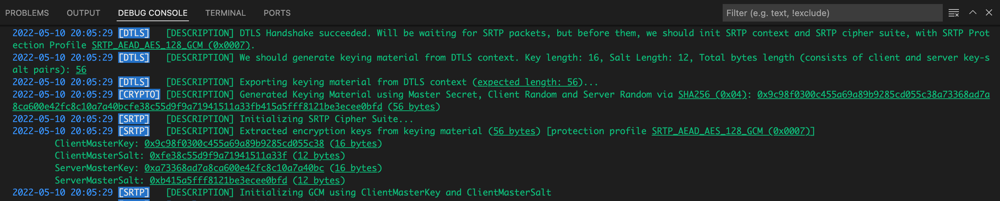

# **6. SRTP INITIALIZATION**

In previous chapter, we completed the [DTLS Handshake](https://datatracker.ietf.org/doc/html/rfc4347#section-4.2) process successfully.

Our DTLS Handshake Context's (HandshakeContext defined in [backend/src/dtls/handshakecontext.go](../backend/src/dtls/handshakecontext.go)) state has been set as "Connected".
<br>
Due to this change, our "OnDTLSStateChangeEvent" event of "UDPClientSocket" in [backend/src/agent/udpclientsocket.go](../backend/src/agent/udpclientsocket.go) was triggered.

* Create a "SRTPContext" object via "NewContext" function of "srtpManager" global object, in [backend/src/srtp/srtpmanager.go](../backend/src/srtp/srtpmanager.go), set it to SRTPContext property of our UDPClientSocket object.

* As you can see here on [Pion WebRTC SRTP project, ProtectionProfile keyLen function](https://github.com/pion/srtp/blob/82008b58b1e7be7a0cb834270caafacc7ba53509/protection_profile.go#L14) and [saltLen function](https://github.com/pion/srtp/blob/82008b58b1e7be7a0cb834270caafacc7ba53509/protection_profile.go#L25), the protection profile which we chose (ProtectionProfile_AEAD_AES_128_GCM) has these constant lengths:
    * keyLen: 16 bytes (our keys will be 16 bytes length)
    * saltLen: 4 bytes (our salt will be 4 bytes length)
    * aeadAuthTagLength: 16 bytes
    
    You can find these values defined  in [backend/src/srtp/protectionprofiles.go](../backend/src/srtp/protectionprofiles.go)

    **Note:** These constant length values can vary for different protection profiles.

* We need a [keying material](https://csrc.nist.gov/glossary/term/keying_material) which has length (2 * keyLen) + (2 * ivLen).
<br>
Because we want:
    * A key for client (clientMasterKey) (16 bytes)
    * A key for server (serverMasterKey) (16 bytes)
    * An salt for client (clientMasterSalt) (12 bytes)
    * An salt for server (serverMasterSalt) (12 bytes)
<br>
<br>
So we need (16+16+12+12) = 56 bytes array which is generated by PHash with our masterSecret and seed. Then we extract our key and salt values from these 56 bytes sequentially.
<br>
<br>
We generate a keying material which has 56 bytes length by asking our DTLS side, via "ExportKeyingMaterial" of our DTLS Handshake Context object in [backend/src/dtls/handshakecontext.go](../backend/src/dtls/handshakecontext.go). Because at this time, our DTLS package's side has mutually negotiated secrets, keys, etc... but SRTP package's side doesn't have yet, also SRTP side needs different types of keys and secrets (attention to DTLS side has "initialization vectors", but SRTP side has "salts").
<br>
<br>
Although our project was designed as a monolith and one package, in real-world DTLS and SRTP are different protocols, for reusability we should distribute them as different libraries. We kept this separate approach, as RFC documents have said and the [Pion WebRTC DTLS project](https://github.com/pion/dtls) and [Pion WebRTC SRTP project](https://github.com/pion/srtp) have done,
        * An orchestrator object asks DTLS side for a [keying material](https://csrc.nist.gov/glossary/term/keying_material) with given length to export. In our project, the orchestrator object is our "UDPClientSocket" object in [backend/src/agent/udpclientsocket.go](../backend/src/agent/udpclientsocket.go)
        * DTLS side generates a [keying material](https://csrc.nist.gov/glossary/term/keying_material) as byte array and then gives it to the orchestrator
        * The orchestrator gives the byte array to SRTP side for extracting keys and salts from given [keying material](https://csrc.nist.gov/glossary/term/keying_material)

<sup>from [backend/src/dtls/finished.go](../backend/src/dtls/finished.go)</sup>

```go
func (ms *UDPClientSocket) OnDTLSStateChangeEvent(dtlsState dtls.DTLSState) {
    logging.Infof(logging.ProtoDTLS, "State Changed: <u>%s</u> [<u>%v:%v</u>].\n", dtlsState, ms.HandshakeContext.Addr.IP, ms.HandshakeContext.Addr.Port)
    switch dtlsState {
    case dtls.DTLSStateConnected:
        logging.Descf(logging.ProtoDTLS, "DTLS Handshake succeeded. Will be waiting for SRTP packets, but before them, we should init SRTP context and SRTP cipher suite, with SRTP Protection Profile <u>%s</u>.", ms.HandshakeContext.SRTPProtectionProfile)
        ms.SRTPContext = srtpManager.NewContext(ms.Addr, ms.Conn, srtp.ProtectionProfile(ms.HandshakeContext.SRTPProtectionProfile))
        keyLength, err := ms.SRTPContext.ProtectionProfile.KeyLength()
        ...
        saltLength, err := ms.SRTPContext.ProtectionProfile.SaltLength()
        ...
        logging.Descf(logging.ProtoDTLS, "We should generate keying material from DTLS context. Key length: %d, Salt Length: %d, Total bytes length (consists of client and server key-salt pairs): <u>%d</u>", keyLength, saltLength, keyLength*2+saltLength*2)
        keyingMaterial, err := ms.HandshakeContext.ExportKeyingMaterial(keyLength*2 + saltLength*2)
        ...
        srtpManager.InitCipherSuite(ms.SRTPContext, keyingMaterial)
    }
}
```

* We call InitCipherSuite of "srtpManager" global object, to initialize SRTP side's cipher suite. The SRTP side's secrets, keys, and methods are different from DTLS side. We give the keying material which is generated at DTLS side.

* It calls "extractEncryptionKeys" function in [backend/src/srtp/srtpmanager.go](../backend/src/srtp/srtpmanager.go) to extract key and salt values from this 56 bytes keying material sequentially. you can find further information [here](https://github.com/pion/srtp/blob/82008b58b1e7be7a0cb834270caafacc7ba53509/keying.go#L14)

<sup>from [backend/src/srtp/srtpmanager.go](../backend/src/srtp/srtpmanager.go)</sup>

```go
func (m *SRTPManager) extractEncryptionKeys(protectionProfile ProtectionProfile, keyingMaterial []byte) (*EncryptionKeys, error) {
    keyLength, err := protectionProfile.KeyLength()
    ...
    saltLength, err := protectionProfile.SaltLength()
    ...

    offset := 0
    clientMasterKey := keyingMaterial[offset : offset+keyLength]
    offset += keyLength
    serverMasterKey := keyingMaterial[offset : offset+keyLength]
    offset += keyLength
    clientMasterSalt := keyingMaterial[offset : offset+saltLength]
    offset += saltLength
    serverMasterSalt := keyingMaterial[offset : offset+saltLength]

    result := &EncryptionKeys{
        ClientMasterKey:  clientMasterKey,
        ClientMasterSalt: clientMasterSalt,
        ServerMasterKey:  serverMasterKey,
        ServerMasterSalt: serverMasterSalt,
    }
    return result, nil
}
```

* You can find generated encryption keys below:



## **6.1. Initialize GCM**

[GCM](https://en.wikipedia.org/wiki/Galois/Counter_Mode) is the abbreviation for "Galois/Counter Mode" and is a type of [Block cipher mode of operation
](https://en.wikipedia.org/wiki/Block_cipher_mode_of_operation).
<br>
We discussed what is GCM and why we call our object as GCM, in initialization of DTLS side GCM in chapter [5.9.1.3. Initialize GCM](./05-DTLS-HANDSHAKE.md).

So, we call the object that makes encryption/decryption over our SRTP and SCTP packets as GCM.

<sup>from [backend/src/srtp/cryptogcm.go](../backend/src/srtp/cryptogcm.go)</sup>

```go
type GCM struct {
    srtpGCM, srtcpGCM   cipher.AEAD
    srtpSalt, srtcpSalt []byte
}
```

* Now, we have an "EncryptionKeys" object defined in [backend/src/srtp/protectionprofiles.go](../backend/src/srtp/protectionprofiles.go).
<br>
We are ready to create our GCM object, which contains our ciphers and salt values. We pass our key values to our "InitGCM" function.
<br>
**Important note:** Which pair (keys.ServerMasterKey, keys.ServerMasterSalt) and (keys.ClientMasterKey, keys.ClientMasterSalt) while passing them to "InitGCM" function below, is important, can vary by "being a client" or "being a server" as application and which GCM object you create (will you use this GCM object to encrypt and send SRTP/SRTCP packets, or to decrypt incoming SRTP/SRTCP packets).
* We call "InitGCM" function only with (keys.ClientMasterKey, keys.ClientMasterSalt), so we only want to decrypt received SRTP/SRTCP packets. We don't need to encrypt at this stage.
* The "InitGCM" function in [backend/src/srtp/protectionprofiles.go](../backend/src/srtp/protectionprofiles.go) calls "NewGCM" function in [backend/src/srtp/cryptogcm.go](../backend/src/srtp/cryptogcm.go). It takes the masterKey and masterSalt of only one side, client or server side.
* Instead of DTLS side, we use AES CM [Key Derivation](https://en.wikipedia.org/wiki/Key_derivation_function). You can find the original code [here](https://github.com/pion/srtp/blob/3c34651fa0c6de900bdc91062e7ccb5992409643/key_derivation.go#L8).
* Instead of DTLS side, we initialize two different pairs of GCM and Salt value for SRTP and SRTCP protocols. We will decrypt incoming packet by different GCM and Salt value corresponding protocol type.
* While creating our ciphers, we create new instances by [aes.NewCipher](https://pkg.go.dev/crypto/aes#NewCipher) and [cipher.AEAD](https://pkg.go.dev/crypto/cipher#AEAD)

<sup>from [backend/src/srtp/srtpmanager.go](../backend/src/srtp/srtpmanager.go)</sup>

```go
    gcm, err := InitGCM(keys.ClientMasterKey, keys.ClientMasterSalt)
```

<sup>from [backend/src/srtp/cryptogcm.go](../backend/src/srtp/cryptogcm.go)</sup>

```go
func NewGCM(masterKey, masterSalt []byte) (*GCM, error) {
    srtpSessionKey, err := aesCmKeyDerivation(labelSRTPEncryption, masterKey, masterSalt, 0, len(masterKey))
    if err != nil {
        return nil, err
    }
    srtpBlock, err := aes.NewCipher(srtpSessionKey)
    if err != nil {
        return nil, err
    }

    srtpGCM, err := cipher.NewGCM(srtpBlock)
    if err != nil {
        return nil, err
    }
    srtcpSessionKey, err := aesCmKeyDerivation(labelSRTCPEncryption, masterKey, masterSalt, 0, len(masterKey))
    if err != nil {
        return nil, err
    }

    srtcpBlock, err := aes.NewCipher(srtcpSessionKey)
    if err != nil {
        return nil, err
    }

    srtcpGCM, err := cipher.NewGCM(srtcpBlock)
    if err != nil {
        return nil, err
    }

    srtpSalt, err := aesCmKeyDerivation(labelSRTPSalt, masterKey, masterSalt, 0, len(masterSalt))
    if err != nil {
        return nil, err
    }

    srtcpSalt, err := aesCmKeyDerivation(labelSRTCPSalt, masterKey, masterSalt, 0, len(masterSalt))

    if err != nil {
        return nil, err
    }

    return &GCM{
        srtpGCM:   srtpGCM,
        srtpSalt:  srtpSalt,
        srtcpGCM:  srtcpGCM,
        srtcpSalt: srtcpSalt,
    }, nil
}

```

* We set returned GCM object to context.GCM and set context.IsCipherSuiteInitialized as true.

Now, we are ready to receive and decrypt incoming SRTP and SRTCP packets. We are not ready to encrypt, because we don't need and implemented this part :blush:

<br>

---

<div align="right">

[&lt;&nbsp;&nbsp;Previous chapter: DTLS HANDSHAKE](./05-DTLS-HANDSHAKE.md)&nbsp;&nbsp;&nbsp;&nbsp;&nbsp;&nbsp;|&nbsp;&nbsp;&nbsp;&nbsp;&nbsp;&nbsp;[Next chapter: SRTP PACKETS COME&nbsp;&nbsp;&gt;](./07-SRTP-PACKETS-COME.md)

</div>